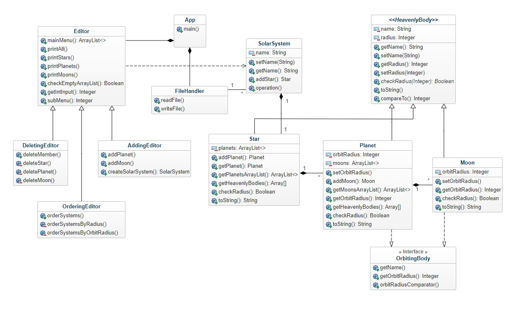

# Notes from the author

## Limits for radius and orbit radius
The stars must have at least a radius of 16700km.
The planets must have a radius of at least 2000km and not bigger than 200000km.
The moons must have a radius of at least 6km and not bigger than 10000km, and can neither have a radius bigger than half the size of the planet (which it is orbiting).

The planets must have an orbit radius of at least 18000km.
The moons must have an orbit radius of at least 60km.
The orbit radius is calculated from surface to surface.

## Suppressed warnings
There have been some warnings when running gradlew build that have been intentionally suppressed. These have been considering that mutable arrayLists are used and sent as arguments when calling methods. My intention when doing the design was that I should pass mutable variables to the methods, since I want to be able to delete members from these mutable objects, so this decision was intentional. 

## Class diagram
This diagram shows all the classes, and the relations between the classes.
However, the diagram does not show every operation and attribute.

